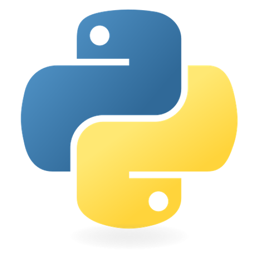
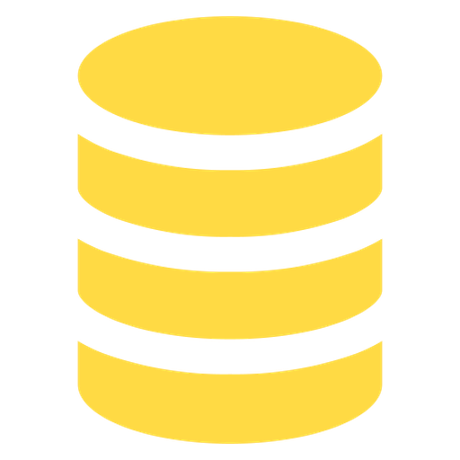
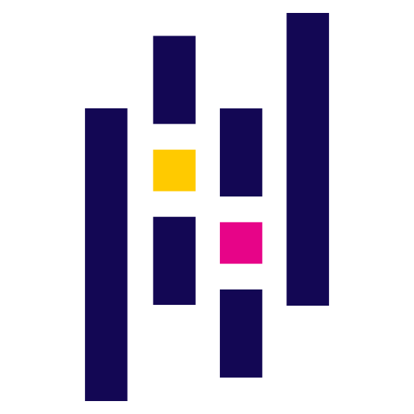
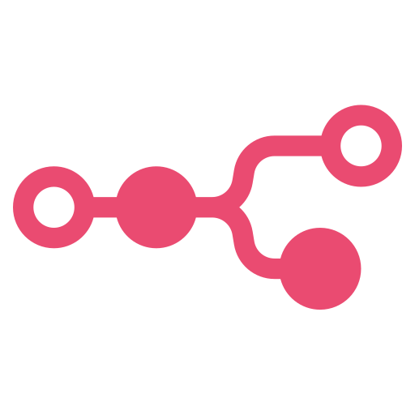
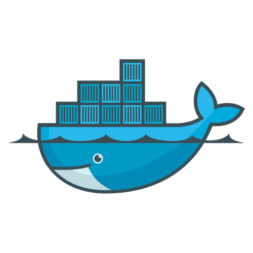
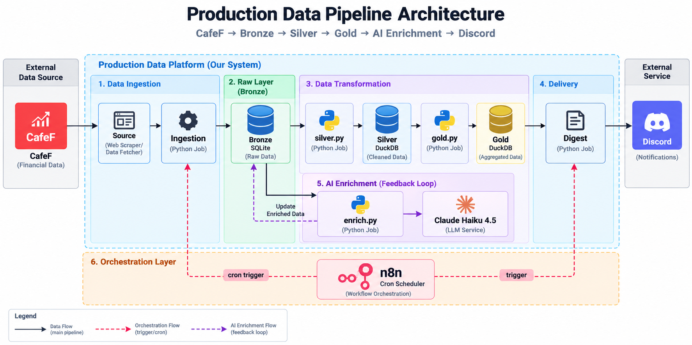

# VN Stock Morning Digest Pipeline

A small, idempotent data pipeline that collects news and daily prices for Vietnamese stocks from CafeF, keeps every raw response in a Bronze layer, cleans and models it into Silver and Gold layers, scores news sentiment with Claude, and posts a morning digest to Discord.

## Tech Stack

| Category | Technologies |
|---|---|
| **Programming** |  Python &nbsp;•&nbsp;  SQL |
| **Data Storage** |  SQLite (Bronze) &nbsp;•&nbsp;  DuckDB (Silver, Gold) |
| **Data Processing** |  pandas &nbsp;•&nbsp; Requests &nbsp;•&nbsp; BeautifulSoup (lxml) |
| **API** |  FastAPI (Uvicorn) |
| **ETL & Orchestration** |  n8n (cron schedule) |
| **Data Modeling** | Medallion (Bronze / Silver / Gold) &nbsp;•&nbsp; Star Schema &nbsp;•&nbsp; OLTP + OLAP &nbsp;•&nbsp; Idempotent rebuilds |
| **DevOps** |  Docker Compose |
| **Automation & AI** |  Anthropic API (Claude Haiku 4.5) &nbsp;•&nbsp;  Discord webhook |

> **Reference only, not investment advice.** Prices come from a single source (CafeF) and are not cross-checked. Sentiment is scored by an AI model from headlines only. This is a learning project.

---

## Overview

**Problem** — A beginner investor wants a short, factual summary of overnight news and the latest prices for a few tickers, and also wants to learn how a real data pipeline works. Doing this by hand every morning is repetitive, and ad-hoc scripts tend to create duplicate rows, lose raw data, and break silently.

**Solution** — A five-layer pipeline with a medallion data model. Raw responses are stored append-only in Bronze. Silver and Gold are rebuilt from scratch on every run, so re-running never creates duplicates. n8n triggers the steps on a schedule, and a small FastAPI worker does the actual work. The design philosophy: *"Source knows the website, Storage knows the database, and nothing else knows both."*

**Data Flow** — n8n cron (07:30, Mon–Fri) → `POST /fetch-news` → `POST /fetch-prices` → `POST /enrich-news` → `POST /build-silver` → `POST /build-gold` → `POST /digest` → Discord webhook.

<p align="center">
  
</p>

---

## Architecture

Source → Ingestion → Storage → Transform → Serving

| Layer | Responsibility | Files |
|---|---|---|
| **Source** | Call CafeF and parse HTML/JSON. No database access. | `python/source/cafef.py`, `cafef_price.py` |
| **Ingestion** | Loop over active tickers, call Source, write raw rows to Bronze, log the run. | `python/ingestion/fetch_news.py`, `fetch_prices.py` |
| **Storage** | Bronze schema (SQLite) and watchlist. | `python/storage/bronze.py`, `watchlist.py` |
| **Transform** | Silver cleaning, Gold star schema, AI enrichment, prompts. | `python/transform/silver.py`, `gold.py`, `enrich.py`, `prompts.py` |
| **Serving** | HTTP endpoints for n8n and the digest text builder. | `python/serving/api.py`, `digest.py` |

### Data layers

| Layer | Engine | Content |
|---|---|---|
| **Bronze** | SQLite (OLTP) | `raw_data` (append-only, unique per source/type/ticker/payload hash), `news_enriched`, `watchlist`, `run_log`, `cost_log` |
| **Silver** | DuckDB (OLAP) | `prices_daily`, `news`, `news_enriched`: typed, deduplicated, validated |
| **Gold** | DuckDB (OLAP) | Star schema: `dim_ticker`, `dim_date`, `fact_price_daily`, `fact_news` |

### Key design decisions

| Decision | How it works |
|---|---|
| **Idempotent by construction** | Bronze uses `INSERT OR IGNORE` with a unique key; Silver and Gold use `CREATE OR REPLACE TABLE`. Running any step twice gives the same result. |
| **Raw data is never edited** | If the source revises a price, the changed payload gets a new hash and a new row. Silver keeps the latest row per (ticker, date). |
| **AI results live in Bronze** | Scored sentiment costs money, so it is stored in the most durable layer and Silver is rebuilt from it. |
| **Versioned prompts** | `PROMPT_VERSION` is part of the primary key, so v1 and v2 results can be compared side by side. |
| **Cost control** | Only headlines are sent, in batches of 20, at most 40 items per run. Token usage and estimated cost go to `cost_log` (estimate only, check the official price list). |
| **Polite scraping** | One request per ticker per day, 2-second delay, an honest User-Agent. `robots.txt` was checked (allowed on 2026-10-07). |

---

## Project Structure

```text
.
├── README.md
├── docker-compose.yaml
├── Dockerfile
├── requirements.txt
├── .env.example
├── .gitignore
└── python/
    ├── config.py
    ├── server.py
    ├── source/          # cafef.py, cafef_price.py
    ├── ingestion/       # fetch_news.py, fetch_prices.py
    ├── storage/         # bronze.py, watchlist.py
    ├── transform/       # silver.py, gold.py, enrich.py, prompts.py
    └── serving/         # api.py, digest.py
```

---

## Quick Start

### Prerequisites

| Requirement | Notes |
|---|---|
| Docker Desktop | Tested on Windows |
| Anthropic API key | Put it in `.env` |
| Discord webhook URL | Create one in your channel settings |

### Setup

```powershell
git clone <repo-url>
cd <repo-folder>
copy .env.example .env      # then fill in the keys listed in the file
docker compose up -d --build
```

| Service | Address |
|---|---|
| n8n | http://localhost:5678 |
| Worker API docs | http://localhost:8000/docs |

### First run

```powershell
curl.exe -X POST http://localhost:8000/init-db
curl.exe -X POST http://localhost:8000/watchlist -H "Content-Type: application/json" -d "{\"ma\":\"FPT\",\"san\":\"HOSE\"}"
curl.exe -X POST http://localhost:8000/fetch-news
curl.exe -X POST "http://localhost:8000/fetch-prices?days=30"
curl.exe -X POST "http://localhost:8000/enrich-news?limit=5"
curl.exe -X POST http://localhost:8000/build-silver
curl.exe -X POST http://localhost:8000/build-gold
curl.exe -X POST http://localhost:8000/digest
```

### Schedule it with n8n

Build one linear workflow in n8n (the workflow export is not stored in this repository):

| Order | Node | Settings |
|---|---|---|
| 1 | Schedule Trigger | Cron `30 7 * * 1-5`, timezone `Asia/Bangkok` |
| 2 | HTTP Request | `POST http://pyworker:8000/fetch-news`, timeout 300000 ms |
| 3 | HTTP Request | `POST http://pyworker:8000/fetch-prices?days=30` |
| 4 | HTTP Request | `POST http://pyworker:8000/enrich-news` |
| 5 | HTTP Request | `POST http://pyworker:8000/build-silver` |
| 6 | HTTP Request | `POST http://pyworker:8000/build-gold` |
| 7 | HTTP Request | `POST http://pyworker:8000/digest` |
| 8 | Discord | Webhook credential, content `{{ $json.text }}` |

Keep the flow linear: each step needs the output of the previous one. Store the webhook URL only in an n8n credential, never in code or in a committed file.

---

## API Endpoints

| Method | Path | Purpose |
|---|---|---|
| GET | `/health`, `/check` | Liveness and installed libraries |
| POST | `/init-db` | Create Bronze tables (safe to repeat) |
| POST | `/watchlist` | Add or update a ticker (max 10 active) |
| POST | `/fetch-news` | Scrape CafeF news into Bronze |
| POST | `/fetch-prices?days=` | Fetch recent daily prices into Bronze |
| POST | `/enrich-news?limit=` | Summarize and score sentiment (-2..+2) |
| POST | `/build-silver` | Rebuild Silver from Bronze |
| POST | `/build-gold` | Rebuild Gold from Silver |
| POST | `/digest` | Build the digest text (under 1900 characters) |
| POST | `/debug/cafef-html`, `/debug/cafef-price` | Save sample responses for fixing parsers |

---

## Configuration

| Item | Where | Notes |
|---|---|---|
| API keys | `.env` | `ANTHROPIC_API_KEY` and others listed in `.env.example`. Never commit `.env`. |
| Data paths | `python/config.py` | `DATA_DIR`, `RAW_DIR`, and the three database files. Overridable by environment variables. |
| Model and limits | `python/transform/enrich.py` | `CLAUDE_MODEL`, `ENRICH_MAX_PER_RUN` (default 40), batch size 20. |
| Prompt | `python/transform/prompts.py` | Bump `PROMPT_VERSION` after any edit. |
| Close-of-session hour | `python/transform/silver.py` | `CLOSE_HOUR = 15` is an assumption used to map news to a trading day. |
| Tickers | `watchlist` table | Managed through `POST /watchlist`, no code change needed. |

---


## Troubleshooting & Limitations

### Troubleshooting

| Symptom | Cause and fix |
|---|---|
| Cannot reach `pyworker:8000` from the browser | That hostname only exists inside the Docker network. Use `localhost:8000` from Windows; n8n uses `http://pyworker:8000`. |
| Parser returns nothing | CafeF may have changed its markup. Run `/debug/cafef-html` or `/debug/cafef-price`, inspect the saved file in `data/debug/`, then fix the parser in `python/source/`. |
| `/build-gold` or `/digest` returns 409 | The previous layer has not been built yet. Run `/build-silver`, then `/build-gold`. |
| `/enrich-news` fails to authenticate | `ANTHROPIC_API_KEY` is missing or wrong in `.env`. Fix it and recreate the container. |

### Limitations

| Area | Limitation |
|---|---|
| Data source | Prices come only from CafeF and are not verified against an independent source such as the exchange. |
| AI scoring | The model sees headlines, not article bodies. Quality has not been validated. |
| Quality and ops | No automated tests, alerting, or backups yet. Back up `data/` manually; Silver and Gold can be rebuilt from Bronze, so Bronze matters most. |
| Scale | Designed for at most 10 tickers; not tuned for large volumes. |
| Dependencies | The n8n image uses `latest`; pin a version before relying on it long-term. `vnstock` is not used because it was quarantined on PyPI at the time of building. |

---

## Roadmap

- [ ] Unit tests for parsers and SQL transforms
- [ ] Failure alerts to a Discord channel
- [ ] Cross-check prices against a second source
- [ ] Dashboard on top of Gold (Looker Studio or Metabase)
- [ ] Scheduled backups of `data/bronze/`

---

*Reference only, not investment advice.*
